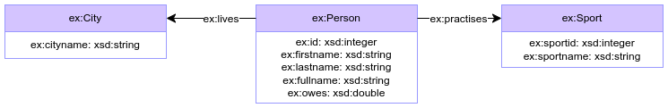
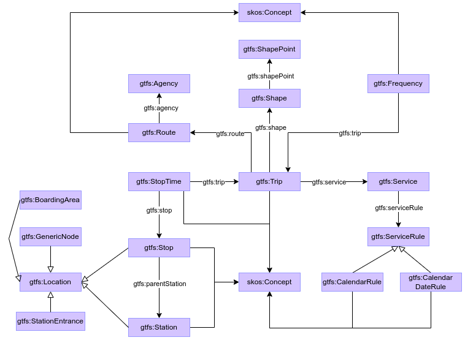
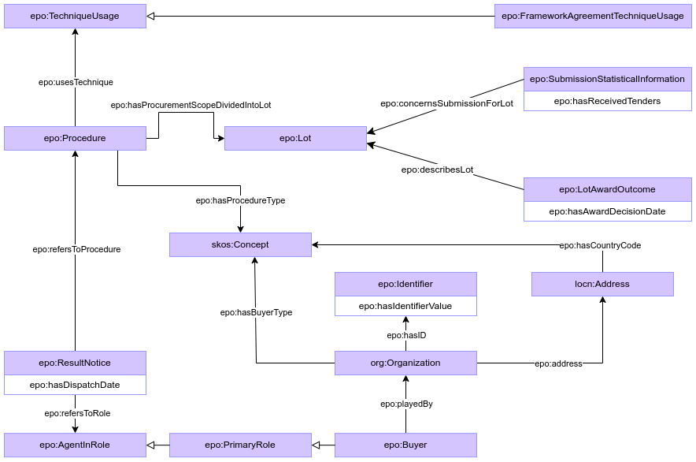

# Benchmark scenarios

## Scenario 1: Schema-Aligned Mapping:
This scenario comprises a total of eight atomic cases, and it is inspired by the [RML test cases](https://kg-construct.github.io/rml-core/test-cases/docs/). Input data is provided for each use case in three different formats with the same content: CSV, JSON and XML.

## Scenario 2: Functional and Partially Aligned Mapping:
This scenario is inspired by the [GTFS-Madrid-Bench](https://github.com/oeg-upm/gtfs-bench) use case. It presents a more realistic and complex setting with task that frequently overlap and interact. The ontology was built from the official [GTFS specification](https://gtfs.org/documentation/overview/) using the classes listed in the following table. Input data is provided in CSV format. 

| Class  | Description |
|--------------------|-------------|
| Agency | Transit companies with service. |
| BoardingArea   | Location where passengers can board and/or alight vehicles. |
| CalendarRule   | Service dates specified using a weekly schedule with start and end dates. |
| CalendarDateRule   | Exception dates for the services. |
| Frequency  | Trip gap for frequency service or condensed schedule. |
| GenericNode| A location within a station, not matching any other location type. |
| Location   | Places where vehicles pick up or drop off riders. |
| Route  | Group of trips that are displayed to riders as a single service. |
| Service| Set of ServiceRules. |
| ServiceRule| Rule that associates dates with services (CalendarRule/CalendarDateRule). |
| Shape  | Rules for mapping vehicle travel paths. |
| ShapePoint | One point in a Shape. |
| Station| Large transit location that may contain multiple Stops. |
| StationEntrance| Location where passengers can enter or exit a station from the street. |
| Stop   | Physical location where a vehicle stops or leaves. |
| StopTime   | Times that a vehicle arrives at and departs from stops for each trip. |
| Trip   | Sequence of two or more stops that occur during a specific time period. |

## Scenario 3: Schema-Distant and High Abstraction Mapping:
This scenario is drawn from the [eProcurement Ontology (ePO)](https://github.com/OP-TED/ePO), the official European data model for public procurement. This ontology is highly complex and is under active, continious development. For this scenario, a subset of ePO's classes was used, that is listed in the following table. Input data is provided in XML format.

| Class  | Description |
|------------------------------------|-------------|
| AgentInRole| Ties an agent to a part they play in a given situational context. |
| Buyer  | Role of an agent that awards a contract and/or purchases items. |
| FrameworkAgreementTechniqueUsage   | Technique that establishes the terms governing contracts to be awarded. |
| Identifier | String to distinguish uniquely one instance of an object. |
| Lot| Division of the services to be procured, allowing the award of contracts. |
| LotAwardOutcome| Result concerning the Lot attributed by the awarder. |
| PrimaryRole| A primary role within the procurement process that ties an agent to a part. |
| Procedure  | Set of administrative activities conducted to conclude one or more contracts. |
| ResultNotice   | Announcement of the award or non-award of a contract by a buyer. |
| SubmissionStatisticalInformation   | Statistical information about submissions on a given Lot. |
| TechniqueUsage | Methods used for conducting procurement procedure. |

